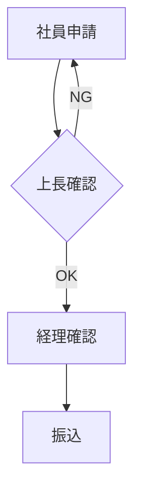

# 74. AIを用いた業務プロセス（BPM）の可視化

## 1. はじめに
業務改善をするには、まず現状の**「業務フロー」**を可視化する必要があります。
しかし、フローチャートを書くのは手間がかかります。
箇条書きのメモから、Geminiにフロー図の元データを作らせましょう。

## 2. Mermaid記法の活用
Geminiは**「Mermaid（マーメイド）」**という、テキストで図を書く記法を出力できます。

> **プロンプト例**:
> 「以下の経費精算プロセスを整理し、**Mermaid形式のフローチャート**のコードを書いてください。
> 1. 社員が申請
> 2. 上長が確認（NGなら差戻し）
> 3. 経理が確認
> 4. 振込処理」

**Geminiが出力するコード**:

これを対応エディタ（ObsidianやNotionなど）に貼れば、瞬時に図になります。

## 3. ボトルネックの発見
図にすることで、「あ、ここでいつも止まってるな」「ここ、二度手間だな」という**ボトルネック**が見えてきます。
AIに「このフローの中で、無駄がありそうな箇所はどこ？」と指摘させるのも有効です。

---

## 4. まとめ
可視化されない業務は、改善できません。
AIを使って一瞬でフロー図化し、チーム全員で「業務の地図」を共有しましょう。

---

content,question_type,option_1,option_2,option_3,option_4,correct_indices,explanation,difficulty,points,tags,category
"複雑な業務フローを整理・可視化するために、Geminiに生成させると便利な「テキストで図を描ける記法」は何ですか？",single,"Morse（モールス信号）","Mermaid（マーメイド）","Braille（点字）","Hieroglyph（ヒエログリフ）",2,"Mermaid記法を使えば、テキストベースの指示からフローチャートやシーケンス図を自動生成できます。Geminiはこのコード生成が得意で、手軽に業務フローを図解化できます。",1,10,"可視化,フローチャート,Mermaid,BPM","ノーコード"

